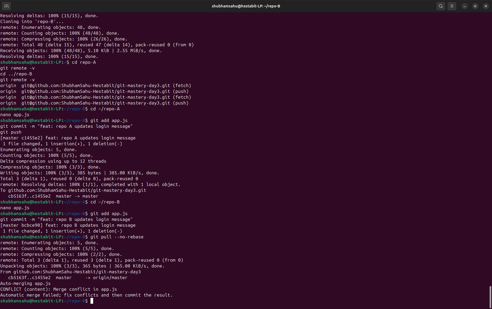
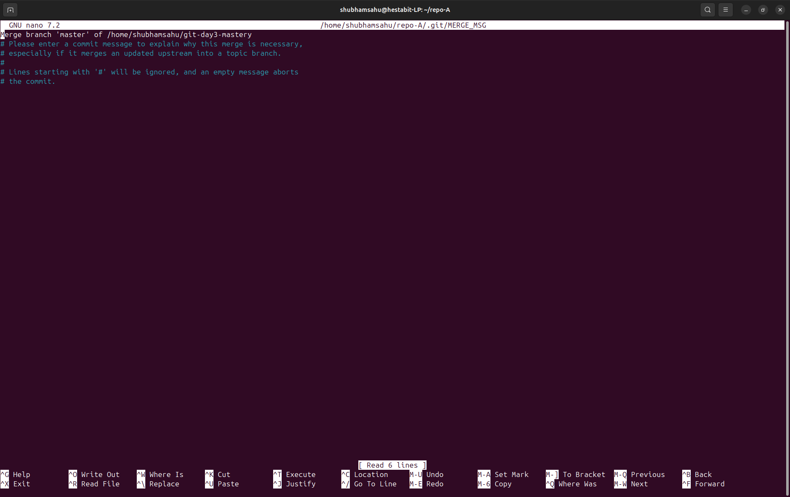
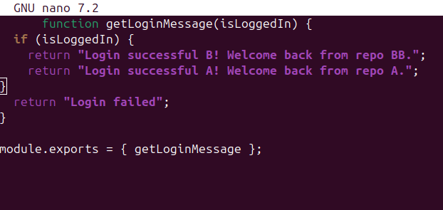
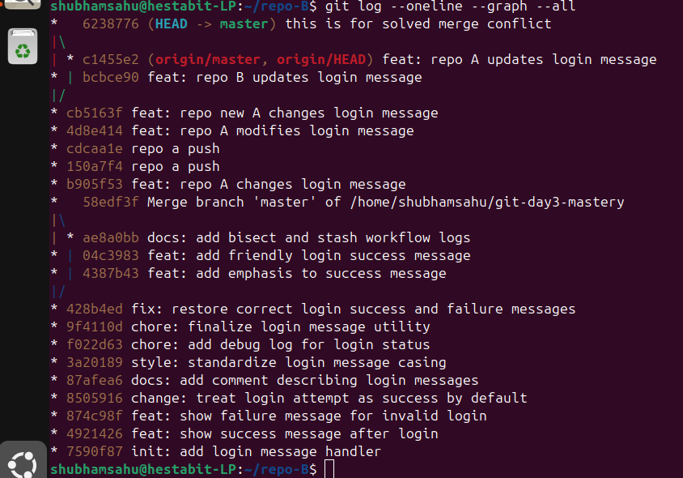

# Merge Conflict Postmortem

## Task Overview
This document explains a real-world **merge conflict scenario** created using
**two local clones of the same repository**. Both clones modified the **same line**
in the same file (`app.js`), causing Git to fail automatic merging.

The conflict was resolved manually while **preserving both changes**, followed by
a successful merge commit.

---

## Repository Setup
- Two local clones were created from the same GitHub repository:
  - `repo-A`
  - `repo-B`
- Both clones tracked the `master` branch.
- The file `app.js` was modified independently in both repositories.

---

## Conflict Scenario
1. `repo-A` modified the login success message in `app.js` and pushed the change.
2. `repo-B` modified the **same line** in `app.js` with a different message.
3. `repo-B` attempted to pull the latest changes from GitHub.
4. Git was unable to auto-merge and reported a merge conflict.

---

## Conflict Detection
The conflict was detected during `git pull` when Git reported a **content conflict**
for `app.js`, indicating that manual resolution was required.

📸 Evidence:

---

## Conflict Markers in File
After detection, Git inserted conflict markers in `app.js`, showing both versions
of the conflicting changes.

📸 Evidence:

---

## Conflict Resolution
- The conflicted file was opened using **Nano**.
- Both versions of the login message were reviewed.
- The final version preserved **both meaningful changes**.
- All conflict markers were removed.

📸 Evidence:

---

## Resolution Verification
After resolving the conflict:
- The file contained no conflict markers.
- The working tree returned to a clean state.

📸 Evidence:

---

## Merge Commit
Once the conflict was resolved:
- The corrected file was staged.
- A merge commit was created.
- The commit history clearly shows branch divergence and merge.

📸 Evidence:

---

## Key Learnings
- Merge conflicts occur during **merge or pull operations**, not commits.
- Conflicts arise when the same lines are modified differently.
- Manual resolution allows intentional preservation of changes.
- Merge commits maintain accurate project history.

---

## Final Status
- Merge conflict successfully detected and resolved.
- Both changes preserved.
- Merge commit created and pushed.
- Task completed as required.
